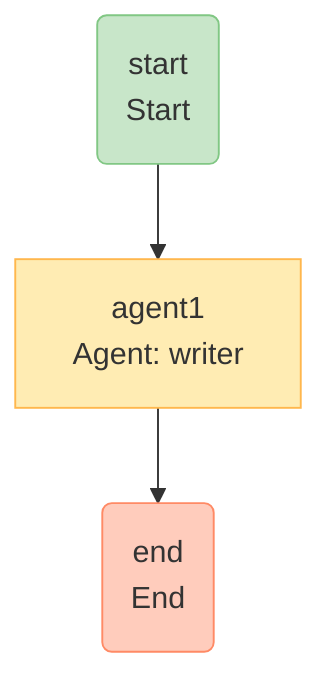

# Graph Visualization

SocietyAI provides powerful visualization capabilities to help you understand,
debug, and document your multi-agent workflows.

---

## 📋 Table of Contents

- [Overview](#overview)
- [CLI Visualization](#cli-visualization)
- [Programmatic Visualization](#programmatic-visualization)
- [Supported Formats](#supported-formats)
- [Mermaid Options](#mermaid-options)
- [Examples](#examples)
- [Best Practices](#best-practices)

---

## Overview

Visualizing your execution graph helps you:

- **Understand** the flow of data between agents
- **Debug** complex workflows with cycles and conditionals
- **Document** your system architecture
- **Communicate** with team members
- **Validate** that your graph structure is correct

---

## CLI Visualization

The easiest way to visualize your society is using the CLI:

```bash
# Generate Mermaid diagram
npx societyai visualize ./my-society.ts --format mermaid --output graph.md

# Generate HTML with embedded diagram
npx societyai visualize ./my-society.ts --format html --output graph.html

# Generate GraphViz DOT format
npx societyai visualize ./my-society.ts --format dot --output graph.dot

# Generate JSON for custom visualization
npx societyai visualize ./my-society.ts --format json --output graph.json

# Change graph direction
npx societyai visualize ./my-society.ts --format mermaid --direction LR

# Use dark theme
npx societyai visualize ./my-society.ts --format html --theme dark

# Highlight execution path
npx societyai visualize ./my-society.ts --format mermaid --highlight start,agent1,end
```

### CLI Options

| Option | Description | Default |
|--------|-------------|---------|
| `--format, -f` | Output format: mermaid, dot, json, html, ascii, plantuml | mermaid |
| `--output, -o` | Output file (default: stdout) | - |
| `--direction, -d` | Graph direction: TD, LR, RL, BT | TD |
| `--theme` | Mermaid theme: default, dark, forest, neutral | default |
| `--highlight` | Highlight execution path (comma-separated node IDs) | - |

---

## Programmatic Visualization

You can also generate visualizations programmatically:

```typescript
import { GraphBuilder, NodeType } from 'societyai/advanced';
import { GraphVisualizer } from 'societyai/advanced';

const engine = GraphBuilder.create()
  .addNode('start', NodeType.START)
  .addNode('agent1', NodeType.AGENT, { agentId: 'writer' })
  .addNode('agent2', NodeType.AGENT, { agentId: 'editor' })
  .addNode('end', NodeType.END)
  .addEdge('start', 'agent1')
  .addEdge('agent1', 'agent2')
  .addEdge('agent2', 'end')
  .build();

// Generate Mermaid diagram
const mermaid = GraphVisualizer.toMermaid(engine, {
  direction: 'LR',
  showAgentNames: true,
  colorByType: true,
});

console.log(mermaid);
```

---

## Supported Formats

### Mermaid (Recommended)

Mermaid is the default format and works great for documentation:

```typescript
const mermaid = GraphVisualizer.toMermaid(engine, {
  direction: 'TD',        // Top-down
  showAgentNames: true,   // Show agent IDs
  colorByType: true,      // Color nodes by type
  highlightPath: ['start', 'agent1', 'end'], // Highlight path
  theme: 'default',       // Theme: default, dark, forest, neutral
});
```

**Output:**


### GraphViz DOT

For advanced graph rendering with GraphViz:

```typescript
const dot = GraphVisualizer.toDOT(engine, {
  rankdir: 'TB',          // Top-bottom
  nodeShape: 'box',       // Node shape
  edgeLabels: true,       // Show edge labels
  clusterByType: true,    // Group nodes by type
});
```

Render with GraphViz:
```bash
dot -Tpng graph.dot -o graph.png
```

### JSON

For custom visualizations or analysis:

```typescript
const json = GraphVisualizer.toJSON(engine);

// Output structure:
{
  nodes: [
    { id: 'start', type: 'start', label: 'start\nStart' },
    { id: 'agent1', type: 'agent', label: 'agent1\nAgent: writer', agentId: 'writer' }
  ],
  edges: [
    { from: 'start', to: 'agent1' },
    { from: 'agent1', to: 'end' }
  ],
  stats: {
    totalNodes: 4,
    totalEdges: 3,
    nodeTypes: { start: 1, agent: 2, end: 1 }
  }
}
```

### HTML

Generate a self-contained HTML file with embedded Mermaid:

```typescript
const html = GraphVisualizer.toHTML(engine, {
  direction: 'LR',
  theme: 'dark',
});

// Save to file
fs.writeFileSync('graph.html', html);
```

Open in browser for interactive viewing.

### ASCII

Quick terminal visualization:

```typescript
const ascii = GraphVisualizer.toASCII(engine);
console.log(ascii);

// Output:
// Graph Structure:
//
// ▶️ start
//    └───▶ agent1
//
// 🤖 agent1
//    └───▶ end
//
// ⏹️ end
```

### PlantUML

For PlantUML-compatible diagrams:

```typescript
const plantuml = GraphVisualizer.toPlantUML(engine, 'LR');

// Output:
// @startuml
// skinparam backgroundColor #FEFEFE
// ...
// @enduml
```

---

## Mermaid Options

The `toMermaid()` method accepts an options object:

```typescript
interface MermaidOptions {
  direction?: 'TD' | 'LR' | 'RL' | 'BT';  // Graph direction
  showAgentNames?: boolean;                // Show agent IDs in labels
  colorByType?: boolean;                   // Apply type-based colors
  highlightPath?: string[];                // Node IDs to highlight
  includeMetadata?: boolean;               // Include metadata in tooltips
  theme?: 'default' | 'dark' | 'forest' | 'neutral';
}
```

### Color Coding

Nodes are automatically colored by type:

| Node Type | Color | Hex |
|-----------|-------|-----|
| START | Green | #c8e6c9 |
| END | Red/Orange | #ffccbc |
| AGENT | Yellow | #ffecb3 |
| PARALLEL | Blue | #bbdefb |
| CONDITION | Purple | #e1bee7 |
| LOOP | Yellow/Gold | #fff9c4 |
| HUMAN | Brown | #d7ccc8 |
| COLLABORATIVE | Teal | #b2dfdb |
| AGGREGATE | Orange | #ffe0b2 |
| TRANSFORM | Light Green | #e8f5e9 |

---

## Examples

### Complex Workflow with Cycles

```typescript
const engine = GraphBuilder.create()
  .addNode('start', NodeType.START)
  .addNode('generate', NodeType.AGENT, { agentId: 'generator' })
  .addNode('validate', NodeType.AGENT, { agentId: 'validator' })
  .addNode('check', NodeType.CONDITION, {
    condition: (result) => result.includes('APPROVED'),
  })
  .addNode('end', NodeType.END)
  .addEdge('start', 'generate')
  .addEdge('generate', 'validate')
  .addEdge('validate', 'check')
  .addConditionalEdge({
    from: 'check',
    condition: (result) => result.includes('APPROVED'),
    truePath: 'end',
    falsePath: 'generate',
  })
  .build();

const mermaid = GraphVisualizer.toMermaid(engine, {
  direction: 'TD',
  highlightPath: ['start', 'generate', 'validate', 'check', 'end'],
});
```

### Parallel Processing

```typescript
const engine = GraphBuilder.create()
  .addNode('start', NodeType.START)
  .addNode('parallel', NodeType.PARALLEL, {
    agentIds: ['analyst1', 'analyst2', 'analyst3'],
  })
  .addNode('aggregate', NodeType.AGGREGATE, {
    aggregator: (results) => results.map((r) => r.output).join('\n'),
  })
  .addNode('end', NodeType.END)
  .addEdge('start', 'parallel')
  .addEdge('parallel', 'aggregate')
  .addEdge('aggregate', 'end')
  .build();

const mermaid = GraphVisualizer.toMermaid(engine, {
  direction: 'LR',
  showAgentNames: true,
});
```

### Collaborative Discussion

```typescript
const engine = GraphBuilder.create()
  .addNode('start', NodeType.START)
  .addNode('debate', NodeType.COLLABORATIVE, {
    agentIds: ['junior', 'senior', 'manager'],
    maxIterations: 5,
  })
  .addNode('end', NodeType.END)
  .addEdge('start', 'debate')
  .addEdge('debate', 'end')
  .build();

const mermaid = GraphVisualizer.toMermaid(engine);
```

---

## Best Practices

### 1. Document Your Graphs

Include generated diagrams in your README:

```markdown
## Workflow Architecture

\`\`\`mermaid
${GraphVisualizer.toMermaid(engine)}
\`\`\`
```

### 2. Use Meaningful IDs

Good IDs make diagrams self-documenting:

```typescript
// ✅ Good
.addNode('validate-input', NodeType.AGENT, { agentId: 'validator' })

// ❌ Bad
.addNode('step3', NodeType.AGENT, { agentId: 'agent2' })
```

### 3. Highlight Critical Paths

Use `highlightPath` to show important flows:

```typescript
const mermaid = GraphVisualizer.toMermaid(engine, {
  highlightPath: ['start', 'process', 'validate', 'deploy'],
});
```

### 4. Version Control Your Diagrams

Generate diagrams as part of your build process:

```json
{
  "scripts": {
    "docs:generate": "societyai visualize ./src/society.ts --format html --output docs/graph.html"
  }
}
```

### 5. Use Appropriate Formats

- **Mermaid**: Documentation, README files
- **HTML**: Interactive viewing, sharing
- **DOT**: High-quality rendering with GraphViz
- **JSON**: Custom tooling, analysis
- **ASCII**: Quick debugging in terminal
- **PlantUML**: Existing PlantUML workflows

---

## 📚 Related Documentation

- [Execution Engine](../5-architecture/execution-engine.md) — How the graph works
- [CLI Reference](../reference/cli.md) — Complete CLI documentation
- [Getting Started](../1-basics/getting-started.md) — First steps with SocietyAI
